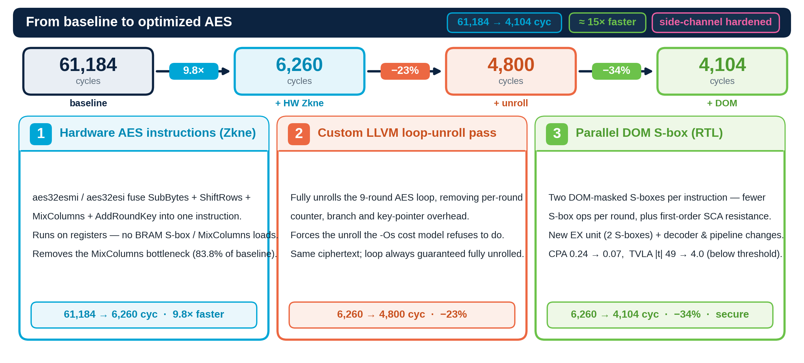
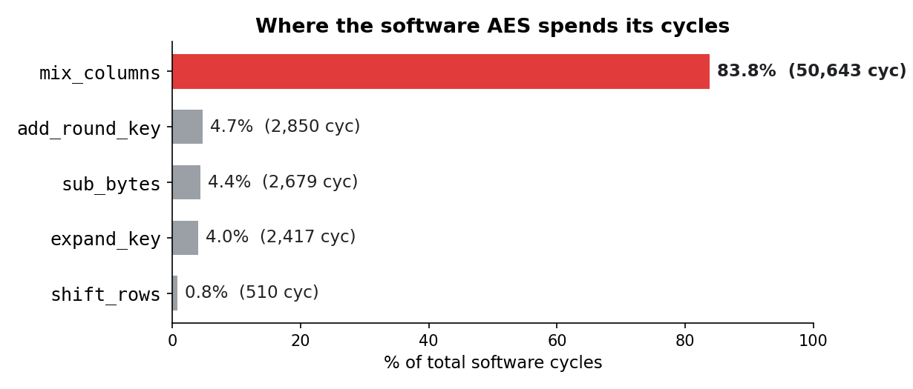
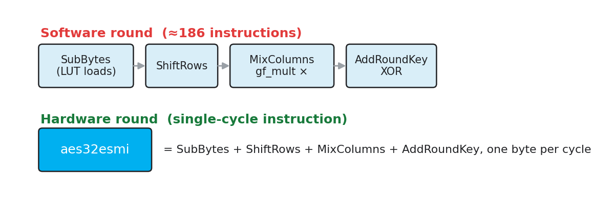
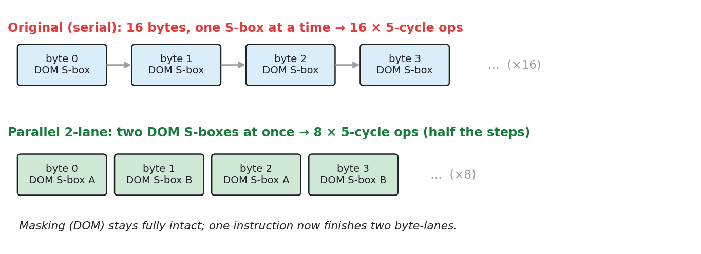
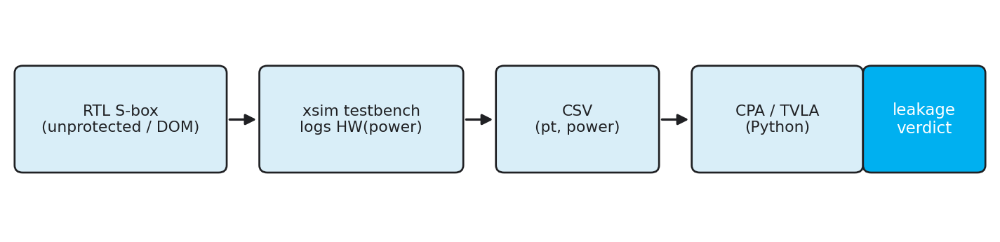
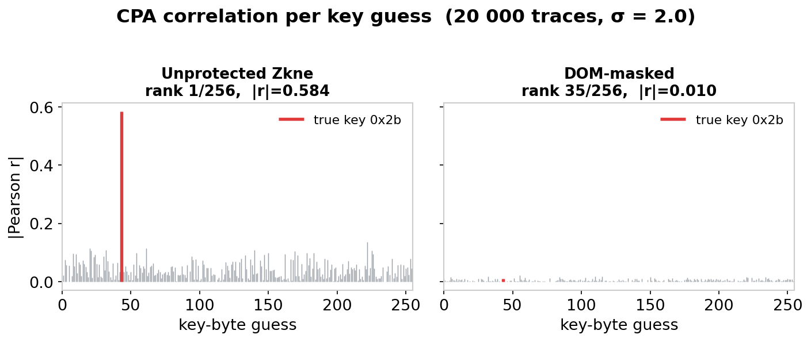
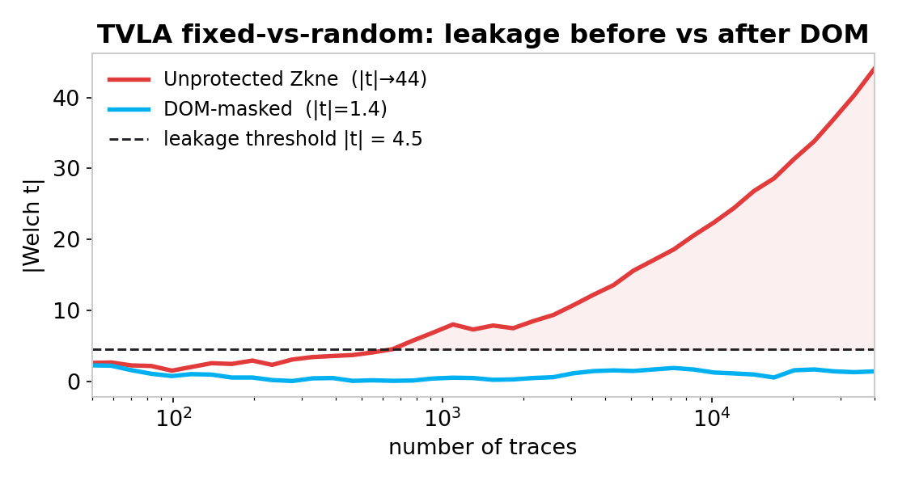

# Hardware/Compiler Co-Design of AES-128 on a RISC-V Soft Core

> Accelerating and hardening AES-128 on a **CV32E40P (RISCY)** RISC-V soft core
> running on a **PYNQ-Z1 (Zynq-7000) FPGA** — through coordinated **RTL**,
> **LLVM compiler**, and **side-channel** work.

[](https://riscv.org/)
[-0a7bbb)](https://github.com/openhwgroup/cv32e40p)
[](#1--hardware-aes-instructions-zkne)
[](#2--custom-llvm-loop-unroll-pass)
[](#hardware--toolchain)
[](#3--side-channel-hardening-dom-masked-s-box)

**TU Delft · CESE4040 Processor Design Project · Q4 2025–2026 · Group 24**

---

<p align="center">
  
</p>

We take a stock software AES-128 implementation on an in-order RISC-V core and
drive it from **61,184 cycles to 4,104 cycles (≈15× fewer cycles)** while *also*
adding first-order side-channel resistance — combining three independent
techniques that stack cleanly:

| Stage | Cycles | Δ | Speedup vs SW baseline |
|---|---:|---:|---:|
| Software AES-128 (pure C) — **baseline** | 61,184 | — | 1.0× |
| `+` Hardware **Zkne** instructions (`aes32esmi` / `aes32esi`) | 6,260 | −90% | **9.8×** |
| `+` Custom **LLVM loop-unroll** pass | 4,800 | −23% | **12.7×** |
| `+` **Parallel DOM S-box** (side-channel hardened) | 4,104 | −15% | **14.9×** |

> All cycle counts are measured directly from the testbench's hardware cycle
> counter (`mem_snoop_match.CLK_COUNT`) in Vivado XSim, ciphertext-verified
> against the AES-128 ECB known-answer test. Numbers are reported against *our*
> measured baseline, not the course PDF's reference figures — see
> [`BASELINE.md`](BASELINE.md).

---

## Why these three changes?

We profiled the baseline before touching anything. Both static
instruction-count analysis and dynamic per-function cycle measurement (via the
`mcycle` CSR) agree: **one function, `mix_columns`, burns 83.8% of all cycles.**

<p align="center">
  
</p>

`mix_columns` is dominated by the bit-serial `gf_mult()` GF(2⁸) multiplier the
compiler inlines 8× per column. That single hot-spot is *exactly* what the
RISC-V scalar-crypto `aes32esmi` instruction collapses into one cycle — so the
profiling directly motivated the hardware work. Full methodology, CPI analysis,
and static-vs-dynamic cross-check: [`PROFILING.md`](PROFILING.md).

---

## What was built

### 1 · Hardware AES instructions (Zkne)

The RISC-V **scalar-cryptography (Zkne)** instructions `aes32esmi` (middle
round) and `aes32esi` (final round) were implemented in the CV32E40P ALU +
decoder. Each fuses SubBytes + ShiftRows + (partial) MixColumns + AddRoundKey
for one byte-lane into a **single-cycle instruction**, eliminating the inlined
software multiplier and its BRAM traffic entirely.

<p align="center">
  
</p>

- RTL: [`pdp-project-24/hardware/src/design/riscy/`](pdp-project-24/hardware/src/design/riscy/)
  (`cv32e40p_zkne.sv`, `cv32e40p_alu.sv`, `cv32e40p_decoder.sv`)
- Exposed to C via inline assembly so the AES source can emit the new opcodes.
- **Result: 61,184 → 6,260 cycles (9.8×).** The MixColumns bottleneck disappears.

### 2 · Custom LLVM loop-unroll pass

A loadable **LLVM pass** (`libAESUnroll.so`, `PassInfoMixin`) identifies the
9-round AES loop and fully unrolls it through LLVM's `UnrollLoop()` utility —
removing per-round counter, branch, and key-pointer overhead that `-Os`
otherwise refuses to unroll.

- Source: [`pdp-project-24/compiler/aes-unroll-pass/AESUnroll.cpp`](pdp-project-24/compiler/aes-unroll-pass/AESUnroll.cpp)
- Used at build time via `clang -fpass-plugin=build/libAESUnroll.so`.
- **Result: 6,260 → 4,800 cycles (−23%),** identical ciphertext.

### 3 · Side-channel hardening (DOM-masked S-box)

The hardware Zkne S-box is fast but leaks: a textbook **CPA** attack recovers
the AES key byte in ~100 simulated traces. We replaced it with a **2-share,
Domain-Oriented-Masking (DOM)** tower-field S-box (`GF((2⁴)²)`, registered
DOM-AND gates, 20 bits of fresh randomness per evaluation) that defeats the same
attack — and laid out two S-box lanes in parallel so the *secure* version is
also *faster* than the unrolled one.

<p align="center">
  
</p>

A complete simulation-based attack rig (CPA + TVLA) quantifies before/after:

<p align="center">
  
</p>

<table>
<tr>
<td width="50%"></td>
<td width="50%"></td>
</tr>
</table>

| Metric | Unprotected Zkne | DOM-masked | Improvement |
|---|---:|---:|---:|
| CPA true-key rank | **1 / 256** (recovered) | 35 / 256 | 35× harder |
| CPA top correlation \|r\| | 0.58 | 0.022 | **26× smaller** |
| TVLA Welch \|t\| (threshold 4.5) | **44.0** (leaks) | 1.4 (clean) | **31× smaller** |
| Key recovered within budget? | Yes, ~100 traces | No (20,000 traces) | — |

> **Scope, stated honestly.** No ChipWhisperer was available, so "power" is the
> simulation proxy `HW(captured_register)` — the standard RTL-level fallback.
> This is a sound demonstration of DOM *principles* (it catches first-order,
> data-dependent leakage) but is **necessary, not sufficient**, for a
> hardware-secure claim, which would need a CW305 board or formal verification
> (SILVER). Full write-up, area/timing cost, and references:
> [`SIDECHANNEL.md`](SIDECHANNEL.md).

---

## Area & timing cost

Everything stays within the FPGA's timing budget — the core had **+5.513 ns of
setup slack** at 100 MHz to spend, and the additions keep it positive.

| Metric (core, OOC synth) | Baseline | With DOM S-box |
|---|---:|---:|
| LUTs | 5,691 (~10.7% of xc7z020) | +182 for the DOM S-box (~+1.5% system) |
| Registers | 2,524 | +100 FFs |
| DSP48E1 | 5 | 5 |
| Setup slack (WNS) @ 100 MHz | +5.513 ns | DOM S-box: +6.054 ns |

Full-system, post-route numbers (10,171 LUTs / 8,522 FFs / 16 BRAM / 1.419 W)
are frozen in [`baselines/post-impl-2026-05-06/`](baselines/post-impl-2026-05-06/).

---

## Hardware & toolchain

| | |
|---|---|
| **Soft core** | CV32E40P "RISCY" (OpenHW Group), single-issue in-order RV32IMAC |
| **FPGA** | Digilent PYNQ-Z1 — Xilinx Zynq-7000 (`xc7z020clg400-1`), hard ARM Cortex-A9 PS + PL |
| **Synthesis / sim** | Xilinx Vivado 2024.2 (XSim behavioural sim, OOC + full synth/impl) |
| **Compiler** | LLVM/clang RISC-V backend + custom pass; GCC for `objcopy` |
| **Workload** | AES-128 ECB, known-answer tested (`fba50914 714bf41f 2e25aabe aaf9080f`) |
| **On-board run** | Bitstream + `.hwh` loaded as a PYNQ Overlay, driven from Jupyter on the PS |

---

## Repository map

This repo is the project showcase + engineering record. The course-graded
sources (RTL, C, the LLVM pass) are vendored under `pdp-project-24/`.

```
.
├── pdp-project-24/            # The graded source tree
│   ├── hardware/src/design/riscy/   # CV32E40P + Zkne/DOM RTL (SystemVerilog)
│   ├── compiler/aes-unroll-pass/    # Custom LLVM loop-unroll pass
│   ├── software/                    # AES-128 C source + Makefile/linker
│   └── future-work/super-instruction/  # custom-0 fused middle-round op (stretch)
├── sidechannel/              # Side-channel rig: DOM S-box, leakage TBs, CPA/TVLA
├── slides_assets/            # Figures used above + in the final presentation
├── BASELINE.md               # Measured baseline: cycles, area, timing (read first)
├── PROFILING.md              # Static + dynamic profiling, CPI analysis, methodology
├── SIDECHANNEL.md            # Side-channel track: attack model, DOM design, results
├── baselines/                # Frozen, dated measurement snapshots (routed reports)
└── references/               # State-of-the-art papers we build on
```

**Start here:** [`BASELINE.md`](BASELINE.md) → [`PROFILING.md`](PROFILING.md) →
[`SIDECHANNEL.md`](SIDECHANNEL.md).

---

## My role (Daniel Tyukov)

This was a 5-person project. My contributions:

- **Baseline & measurement infrastructure** — established the measured baseline
  (cycles / OOC area / timing) and the reproducible **C → COE → simulation →
  synthesis → bitstream** pipeline the whole team built against.
- **`aes32esmi` middle-round instruction** (with Vishnu & Rishi) — the RTL for
  the dominant middle-round acceleration.
- **Side-channel resilience track (individual)** — designed and verified the
  tower-field **DOM-masked S-box**, built the simulation-based **CPA/TVLA attack
  rig**, and produced the before/after leakage analysis shown above.

---

## Reproduce / build

<details>
<summary><b>Build the software & run the simulation</b></summary>

```bash
# Compile AES C → memory-init files, refresh the sim inputs
cd pdp-project-24/software
make soft
cp bin_files/*.coe ../hardware/src/sw/mem_files/   # most common footgun if skipped

# In Vivado's TCL console (from pdp-project-24/hardware/):
source ./scripts/create_project.tcl       # baseline RISCY project
source ./scripts/run_simulation.tcl        # behavioural sim (~3 min)
source ./scripts/create_project_ooc_synth.tcl  # OOC synth: area + timing
source ./scripts/gen_bitstream.tcl         # full bitstream for the PYNQ-Z1
```

Build the LLVM pass:

```bash
cd pdp-project-24/compiler/aes-unroll-pass
cmake -B build -DLLVM_DIR=<llvm>/lib/cmake/llvm && cmake --build build
clang -fpass-plugin=build/libAESUnroll.so ...
```

Reproduce the side-channel results: see the step-by-step driver/analysis
commands in [`SIDECHANNEL.md`](SIDECHANNEL.md) §6.
</details>

<details>
<summary><b>Team workflow & dev-server access (internal)</b></summary>

Development happens on a shared TU Delft server (Vivado + LLVM + RISC-V GCC
pre-installed); helper scripts in [`scripts/`](scripts/) wrap SSH, SSHFS mount,
Vivado launch, and artifact fetch. Credentials live outside the tree in a
`.gitignore`d `credentials.txt` (copy from `credentials.example.txt`). See
[`CLAUDE.md`](CLAUDE.md) for the full server/toolchain layout and gotchas.

```bash
./scripts/connect-server.sh                 # ssh into the dev server
./scripts/mount-server.sh                   # sshfs-mount server $HOME
./scripts/fetch-from-server.sh --bitstream  # pull bitstream + .hwh to ./artifacts/
```
</details>

---

## References we build on

- **RISC-V Scalar Crypto Extensions v0.9.3** — canonical `aes32esi`/`aes32esmi` encoding.
- **OpenHW Group CV32E40P User Manual** — authoritative RISCY reference.
- Gross, Mangard, Mendel — *Domain-Oriented Masking* (TIS 2016).
- Canright — *A Very Compact S-Box for AES* (CHES 2005).
- Kassimi et al. — *Secure Implementation of RISC-V's Scalar Cryptography Extension Set* (Cryptography, 2026).

---

<sub>Coursework for TU Delft CESE4040 (Q4 2025–2026), Group 24. Course-provided
materials remain the property of their authors.</sub>
```