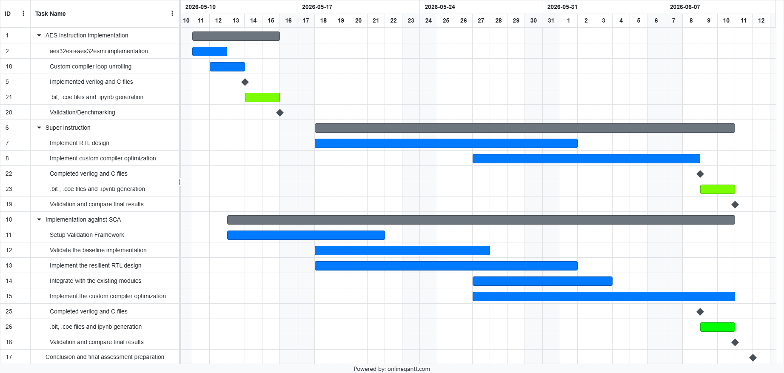

# Intermediate Report: Final Answers

CESE4040 Processor Design Project, Q4 2025-2026, Group 24.

Group members: Daniel Tyukov, Rishi, Vishnu Karthik, Hruday Gowda, Sathya.

---

## Q1. What extension(s) and improvement(s) are you planning to implement?

Mandatory items:

1. The Zkne instructions `aes32esi` and `aes32esmi` in the RISCY core (CV32E40P ALU + decoder).
2. A built-in LLVM loop-unroll pass on the AES middle-round loop.

Group-specific improvement: we propose two options and will commit to one after TA feedback and Prof. Mottah Taouil's reply on validation methodology.

- **Option 1: side-channel-resilient AES via Domain-Oriented Masking**, following Kassimi et al. (2026) from this department.
- **Option 2: a custom super-instruction under the `custom-0` opcode.** It fuses the four chained `aes32esmi` calls that compute one output word into a single instruction. Inspired by Pan et al. (2021).

Each option has its own validation pipeline. Running both inside six weeks would compromise both, so we commit to one.

---

## Q2. What metrics will be used to evaluate the final design?

Primary metric: cycle count for AES-128 ECB encryption of one 16-byte block, measured in behavioural simulation by `mem_snoop_match.CLK_COUNT` from fetch-enable to the `0xDEADBEEF` end sentinel. Baseline 59,560 cycles.

Secondary metrics, all reported as absolute value plus delta against the baseline:

- Functional correctness: ciphertext equals `fba50914 714bf41f 2e25aabe aaf9080f`.
- `mix_columns` cycle share, from `mcycle` CSR brackets. Baseline 83.8 %.
- Area in LUTs and registers, OOC and post-impl. Baseline 5,691 / 2,524 OOC, 10,171 / 8,522 post-impl.
- Worst Negative Slack, OOC and post-impl. Baseline +5.513 ns OOC at 100 MHz, +28.306 ns post-impl at 20 MHz.
- On-chip power from `report_power`. Baseline 1.419 W (1.256 W is the always-on PS7).

For Option 1 we additionally use TVLA, CPA, and key-rank analysis on simulated power traces extracted from `.vcd` waveforms via a Hamming-distance leakage model.

---

## Q3. Why have you chosen for these extension(s) / improvement(s)?

The mandatory items target the measured hot path. `mix_columns` is 83.8 % of cycles in our baseline, with the inner software loop already inlined by the compiler. `aes32esmi` collapses that inner loop; loop-unrolling on top removes the surrounding overhead.

Option 1 is justified because AES hardware that leaks key-dependent power is broken in any setting where an attacker can probe: IoT nodes, smart cards, secure elements. The honest limitation is that we don't have a ChipWhisperer, so our validation runs on simulated traces. We will report it as a simulation-based assessment, not real-silicon measurement.

Option 2 is justified because even with Zkne in place, one output word of one round still costs four chained `aes32esmi` calls, so a full encryption costs 144 of them. Folding each chain of four into one instruction reduces the dynamic instruction count by 4x and removes register-file traffic between the four steps.

We propose two options because each one has a distinct validation framework that we cannot reasonably set up in parallel. The TA's view on which option fits the course's intent, plus Prof. Mottah's view on whether our simulated Option-1 validation is rigorous enough, will decide the pick.

---

## Q4. Methodology: tasks, ownership, integration / baseline / validation

The team agreed (2026-05-08 poll) to split into three sub-teams: RTL (2 people), Validation (2 people), Compiler (1 person). Specific names are assigned via the team poll closing tonight.

**A) Integration**

- A1: `aes32esi` decode + execute in `cv32e40p_decoder.sv` and `cv32e40p_alu.sv` (RTL)
- A2: `aes32esmi` decode + execute in the same files (RTL)
- A3: Verify GAS encoding; expose the new instructions to C via `asm volatile` (Compiler)
- A4: Add LLVM intrinsics for both Zkne ops; rebuild LLVM in `$HOME` (Compiler)
- A5: Wire LLVM's `LoopUnrollPass` to the middle-round loop (Compiler)
- A6: [Opt 2] Super-instruction RTL under the `custom-0` opcode (RTL)
- A7: [Opt 2] Compiler support for the super-instruction (Compiler)
- A8: [Opt 1] SCA validation framework: `.vcd` extract, Hamming-distance traces, TVLA / CPA / key-rank scripts (Validation)
- A9: [Opt 1] DOM-protected variant of `aes32esi`/`aes32esmi` (Validation)
- A10: [Opt 1] Compiler support for the protected variant (Compiler)

A1-A5 always run. We execute A6-A7 or A8-A10 depending on the chosen option.

**B) Baseline (done in Phase 1)**

- B1: Cycle baseline: 59,560 cycles, ciphertext PASSED.
- B2: OOC synthesis: 5,691 LUTs / 2,524 registers / 5 DSPs / WNS +5.513 ns at 100 MHz.
- B3: Post-implementation (full `riscv_wrapper`, routed): 10,171 LUTs / 8,522 registers / 16 BRAMs / 5 DSPs / WNS +28.306 ns at 20 MHz / 1.419 W on-chip power.
- B4: Static profiling from `objdump`: `mix_columns` 88 % of static instructions.
- B5: Dynamic profiling via `mcycle` brackets: `mix_columns` 83.8 % of measured cycles.

**C) Validation and measurements**

- C1: Re-run baseline AES sim after every RTL change, confirm `Test PASSED`, record cycles.
- C2: Re-run OOC synth, capture LUT / register / DSP delta and WNS.
- C3: Generate full bitstream after each clean sim+synth pair. (Pipeline already proven: 4,045,673 B `riscv_wrapper.bit` built 2026-05-08.)
- C4: Upload to PYNQ-Z1, run `base_riscy.ipynb`, confirm wall-clock ciphertext matches sim.
- C5: Re-run dynamic profiling after `aes32esmi` lands.
- C6: Final benchmark: cycles + ciphertext on multiple AES test vectors.
- C7: [Opt 1] TVLA on simulated traces from the unprotected baseline (sanity check that the framework detects leakage).
- C8: [Opt 1] TVLA, CPA, and key-rank on the protected variant.
- C9: Final write-up, slides, demo, archive.

---

## Q5. Planning: Gantt chart and milestones

The team's Gantt chart is attached to this question as `2026-05-08-rishi-gantt.png`.

Milestones (dates from the Gantt):

- **M1, 2026-05-08.** Intermediate report submitted; Phase 1 closed.
- **M2, 2026-05-14.** Zkne instructions and the loop-unroll pass working in simulation; ciphertext still passes.
- **M3, 2026-05-15.** Bitstream for the mandatory variant generated; first cycle count recorded against 59,560.
- **M3.5, 2026-05-15.** Decision on the group-specific option after TA and Prof. Mottah's feedback.
- **M4, 2026-06-09.** Selected option's RTL and C files in.
- **M5, 2026-06-11.** Final validation. Option 2: cycle count and PYNQ-Z1 board verification. Option 1: TVLA, CPA, and key-rank on the protected design.
- **M6, 2026-06-12.** Source archive submitted, slides ready, demo rehearsed.